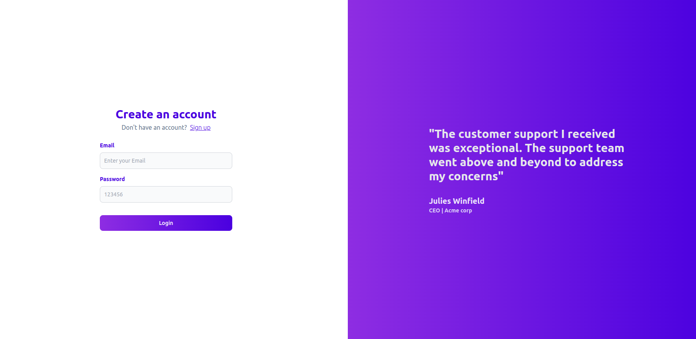
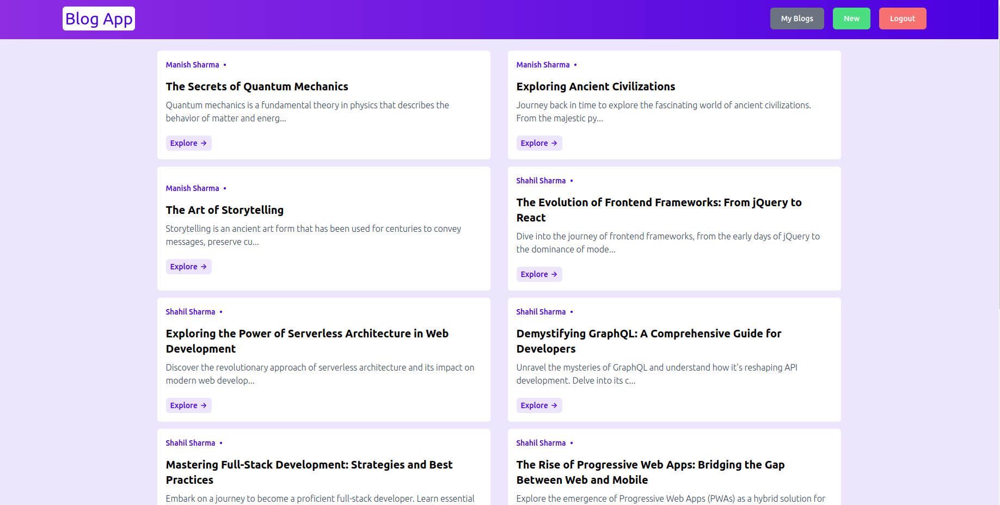
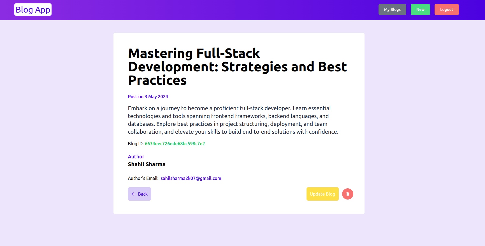

# Blog App - client

## Description

Blog App is a Full Stack Web Application for Viewing other people's Blogs and creating your own Blogs.

The Blog App has the following features:

- `Auth` User can SignUp by creating an account through his/her email. The email is also verified by sending an OTP.
- `Login` User can login by his/her email and password set while SignUp.
- `HomePage` User can see all the Blogs present in the website.
- `My Blogs` The website has a My Blog section where user can se it's own created Blogs. The user can also Update and Delete their own Blogs.

## Login Page



## Home Page



## Full Blog Page



## Technologies Used

### Frontend

- HTML
- Tailwind CSS
- Typescript
- React
- Vite (Bundler)

### Backend

- Typescript
- Express
- Mongoose
- Nodemailer
- Zod

[Backend Repository !](https://github.com/Sahil2k07/Blog-App-Server)

## Set-Up this Project Locally

### 1. First Clone the Repository to your local machine

```bash
git clone https://github.com/Sahil2k07/Blog-App.git
```

### 2. Set-Up Backend

1. Move to the `Blog-App` directory.

   ```bash
   cd Blog-App
   ```

2. If there is a server directory already then run this command or first make a server directory and then run the command to move to `server`.

   ```bash
   cd server
   ```

3. Now run the command to clone the `Backend` code in the server directory.

   ```bash
   git clone https://github.com/Sahil2k07/Blog-App-Server.git .
   ```

4. Make sure you have Typescript installed Globally.

   ```bash
   npm i -g typescript
   ```

5. Set-Up all the required environment variables by making a `.env` file in the `server` directory. An example file has been given for it.

   ```dotenv
   MONGO_URL=

   PORT=

   JWT_SECRET=

   # Nodemailer Details
   MAIL_HOST=
   MAIL_USER=
   MAIL_PASS=
   ```

6. Install all the Dependencies.

   ```bash
   npm i
   ```

7. Build the working `dist` file

   ```bash
   tsc -b
   ```

8. Ignite the `Backend` by running the following command.

   ```bash
   npm run start
   ```

### 3. Set-Up Frontend

1. First make a `.env` file and provide the Backend Url of the project. An example file is given.

   ```dotenv
   VITE_BASE_URL=
   ```

2. Install all the dependencies for the Frontend by running the following command in Blog-App directory

   ```bash
   npm i
   ```

3. Ignite the Frontend by running the command in another terminal in Blog-App directory.

   ```bash
   npm run dev
   ```
